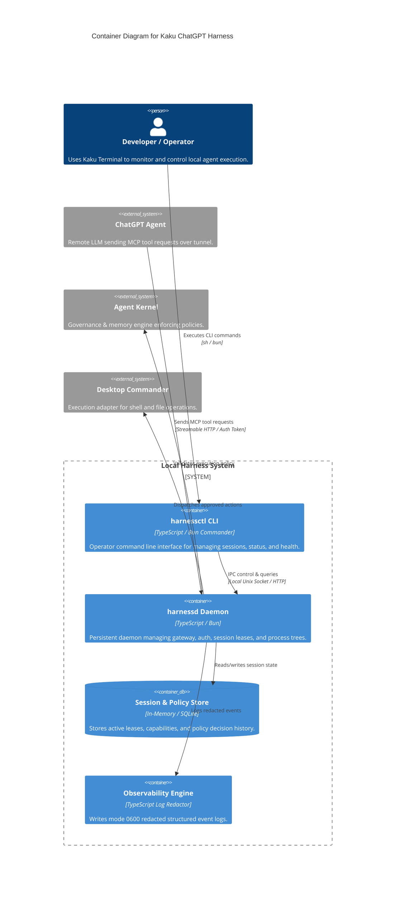

# Architecture & Design Specifications

This document outlines the software architecture for the **Kaku + MCP-Start ChatGPT-Native Local Harness** using the C4 Model.

## C4 Container Diagram

## C4 Sequence Diagram: Authenticated Execution Flow

```mermaid
sequenceDiagram
    autonumber
    participant ChatGPT as ChatGPT
    participant Gateway as harnessd (Gateway)
    participant Session as Session Core
    participant Policy as Policy Adapter (Agent Kernel)
    participant Obs as Observability Logger
    participant Exec as Desktop Commander

    ChatGPT->>Gateway: POST /mcp/v1/tools/call (Bearer Token)
    Gateway->>Session: Validate Lease & Token
    alt Invalid / Expired Token
        Session-->>Gateway: Unauthorized
        Gateway-->>ChatGPT: 401 Unauthorized
    else Valid Token
        Session-->>Gateway: Lease Active (Project Scoped)
        Gateway->>Policy: Evaluate Tool Call Policy
        alt Policy Rejected
            Policy-->>Gateway: Action Denied (Security Policy)
            Gateway->>Obs: Log Security Denial (Mode 0600)
            Gateway-->>ChatGPT: Tool Result: Denied
        else Policy Approved
            Policy-->>Gateway: Action Approved
            Gateway->>Exec: Dispatch Execution Command
            Exec-->>Gateway: Return Command Output
            Gateway->>Obs: Write Redacted Log Entry (Mode 0600)
            Gateway-->>ChatGPT: Tool Result: Success (Redacted)
        end
    end
```

